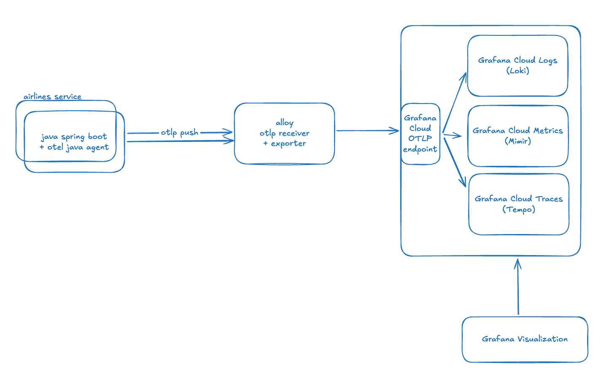
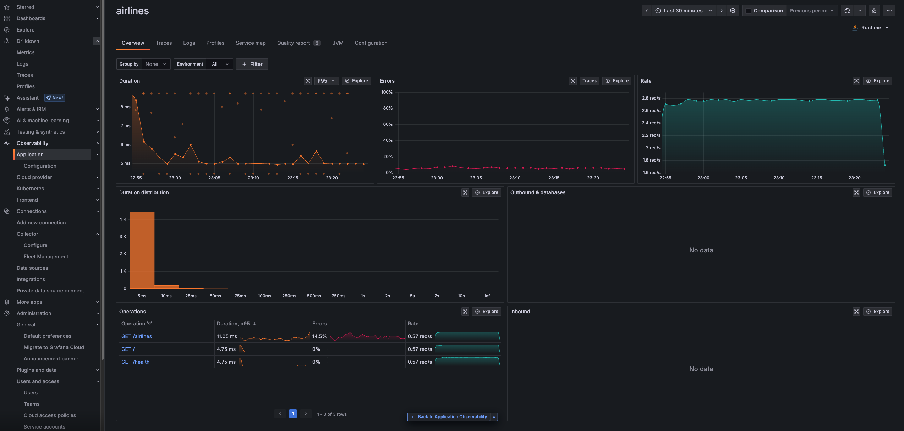

# Java OTLP to Grafana Cloud demo

- [About](#about)
- [Getting Up and Running](#getting-up-and-running)
  - [Prerequisites](#prerequisites)
  - [Spin up all services](#spin-up-all-services)
  - [Spin up the `airlines` service](#spin-up-the-airlines-service)
  - [Spin up the `frontend` service](#spin-up-the-frontend-service)
- [Simulate traffic to the services](#simulate-traffic-to-the-services)
  - [airlines-loadgen](#running-airlines-loadgen)

# About

This application comprises the following services:

| Name | Description | Tech | Quick Link |
| :---: | :---: | :---: | :---: |
| `airlines` | Backend service | Java Spring Boot app | http://localhost:8080/swagger-ui/index.html#/ |
| `frontend` | Frontend service | React app | http://localhost:3000/ |
|||

The `frontend` service is a simple React app that makes API requests to the `airlines` service. (WIP)



# Getting Up and Running

## Prerequisites

- Install [Docker](https://docs.docker.com/engine/install/) on your local machine
- Clone this repo to your local machine
```
git clone https://github.com/ar2pi/java-otlp.git
```

## Spin up all services

From the project root, run all the services with the following command:
```
make up
```

- *The `airlines` service will run on http://localhost:8080/ with Swagger doc UI at http://localhost:8080/swagger-ui/index.html#/*
- *The `frontend` service will run on http://localhost:3000/*

Stop the services with the following command:
```
make down
```

Continue reading to see how to spin up an individual service as opposed to running all services at once.

## Spin up the `airlines` service   

From the `airlines` directory:

Build the app
```
make build
```

Run the app
```
make run
```
*The `airlines` service will run on http://localhost:8080/ with Swagger doc UI at http://localhost:8080/swagger-ui/index.html#/*

Alternatively, use a single command to both build and run the app
```
make start
```

Gracefully stop the app
```
make stop
```

Clean up the container(s)
```
make clean
```

## Spin up the `frontend` service

From the `frontend` directory:

Build the app
```
make build
```

Run the app
```
make run
```
*The `frontend` service will run on http://localhost:3000/*

Gracefully stop the app
```
make stop
```

# Simulate traffic to the services

The `scripts/` directory includes load generator scripts you can use to make batch sets of requests to your running services.

- The `airlines-loadgen.sh` script generates load to the `airlines` service

## Running airlines-loadgen

*Note: You may need to run the following command to add the proper permissions to execute the script*
```
chmod +x airlines-loadgen.sh
```

The `airlines-loadgen` script makes API requests to the `airlines` service. You can optionally specify the following parameters to the script:
- An error rate `-e` to force the requests to the service to error out at that rate
- A duration `-d` to specify the number of seconds the script should run
- A base URL `-b` if you are running the service on a port other than the default

From the `scripts/` directory:

- Run the script with default params
  ```
  ./airlines-loadgen.sh
  ```

- View usage
  ```
  ./airlines-loadgen.sh -h
  ```

- Example: Run the script for 1h generating a 25% error rate within the `airlines` service
  ```
  ./airlines-loadgen.sh -e 0.25 -d 3600
  ```

# Visialize generated telemetry in Grafana Cloud

- Head to your Grafana instance [Drilldown page](https://grafana.com/docs/grafana/latest/explore/simplified-exploration/) to view generated metrics, logs and traces
image.png
- Enable [Application Observability](https://grafana.com/docs/grafana-cloud/monitor-applications/application-observability/setup/) (optional)

Example `airlines` service in Application Observability page:


# Resources

- [How to Instrument a Java application using OpenTelemetry for Grafana Cloud (Grafana docs)](https://grafana.com/docs/opentelemetry/instrument/grafana-java/)
- [Zero-code instrumentation for Java (Opentelemetry docs)](https://opentelemetry.io/docs/zero-code/java/agent/getting-started/)
- [Grafana OpenTelemetry Distribution for Java (github)](https://github.com/grafana/grafana-opentelemetry-java/blob/main/README.md)

# Next steps

- [ ] Set up [Frontend Observability](https://grafana.com/docs/grafana-cloud/monitor-applications/frontend-observability/quickstart/react/)
- [ ] [Integrate App o11y with Frontend o11y](https://grafana.com/docs/grafana-cloud/monitor-applications/application-observability/integrate-rum/)
